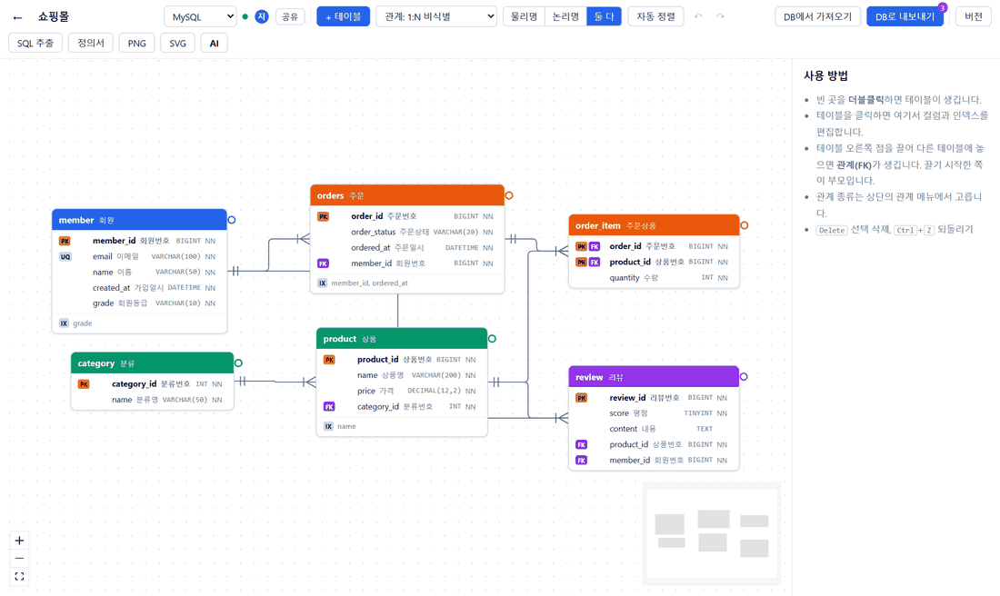
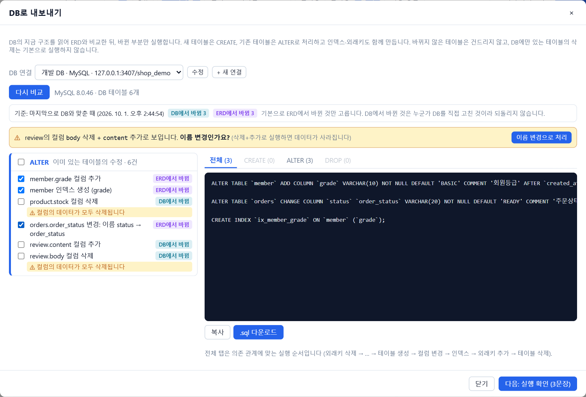
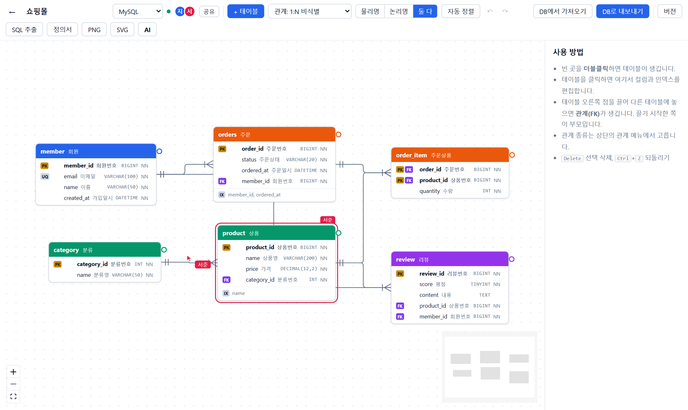
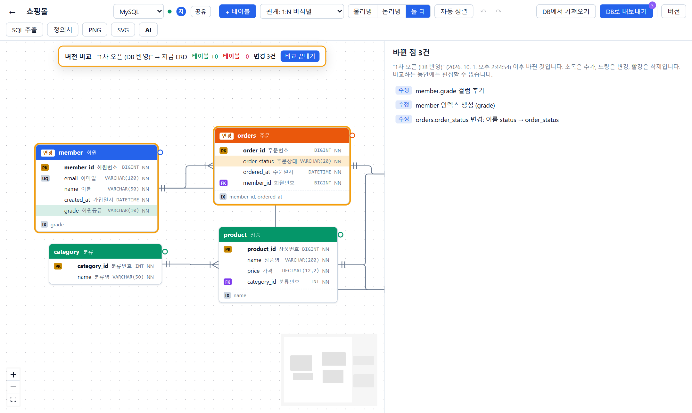
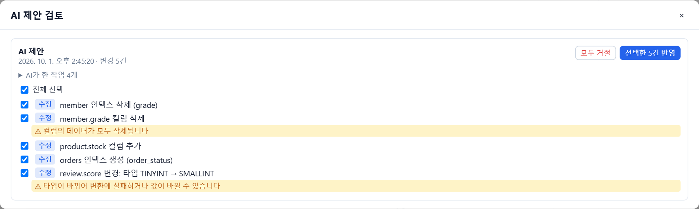

# ERD

[](https://github.com/isanguk38/erd/actions/workflows/ci.yml)

**DB와 바로 동기화하고, 여러 사람·AI와 함께 설계하는 ERD 도구.**

ERD를 그리는 도구는 많지만, 실무에서 가장 귀찮은 건 **DB를 고친 뒤 ERD를 다시 맞추는 일**과 **ERD를 고친 뒤 ALTER 문을 손으로 짜는 일**입니다.
이 도구는 MySQL·MariaDB·PostgreSQL·Oracle·SQL Server에 직접 연결해 두 방향을 모두 자동으로 처리하고, 그 과정에서 **데이터를 잃지 않도록** 설계했습니다.



## 주요 기능

| | |
|---|---|
| **DB에서 가져오기** | DB에 연결해 테이블·컬럼·인덱스·FK·코멘트를 읽어 ERD를 만들거나, 바뀐 부분만 반영. 배치·색상·한글 논리명은 유지 |
| **DB로 내보내기** | ERD와 DB를 비교해 **바뀐 부분만** CREATE / ALTER / INDEX / FK로 실행. 바뀌지 않은 테이블은 건드리지 않음 |
| **3방향 비교** | 마지막으로 DB와 맞춘 시점을 기준으로 *DB에서 바뀜 / ERD에서 바뀜 / 둘 다 바뀜*을 구분. 남이 DB에 직접 고친 것을 되돌리지 않음 |
| **이름 변경 추정** | 삭제+추가로 보이는 컬럼·테이블이 모양이 같으면 "이름 변경인가요?"라고 묻고 `RENAME`으로 처리 (데이터 보존) |
| **DB 차이 알림** | 연결한 DB를 주기적으로 확인해 "DB에서 3건 바뀜" 배지 표시 |
| **실시간 동시 편집** | Yjs(CRDT) 기반. 다른 사람의 커서·선택이 보이고, 같은 테이블을 동시에 고쳐도 충돌하지 않음 |
| **AI 연결 (MCP)** | Claude 등에서 "쿠폰 테이블 설계해줘" → ERD에 바로 반영(한 번에 되돌리기) 또는 제안으로 쌓아 사람이 항목별 승인 |
| **SQL 추출** | 전체 CREATE 또는 기준 버전 이후 변경분. CREATE/ALTER/DROP 분리, 위험한 변경 경고 |
| **테이블 정의서 Excel** | 표지·목록·테이블별 컬럼/인덱스/FK·변경 이력 (국내 SI·공공 산출물 양식) |
| **버전 비교** | 이전 버전과 지금 ERD를 캔버스에 겹쳐 추가(초록)/변경(노랑)/삭제(빨강)로 표시 |
| **로그인·공유** | GitHub 로그인, 프로젝트별 소유자/편집/보기 권한, 초대 링크 |
| **설계 검사** | 기본키 없음, FK 타입 불일치, FK 인덱스 없음, 이름 규칙(snake_case/camelCase) 섞임, 논리명 없음, 중복 인덱스를 찾아 목록으로. 클릭하면 이동, FK 인덱스는 바로 추가, AI에게 고쳐 달라고 할 수 있음(MCP `check_design`) |
| **영역 · 여러 개 선택** | 관련 테이블을 색깔 상자로 묶고(접기·함께 옮기기), Shift+드래그·Ctrl+클릭으로 여러 개 골라 옮기기·복사/붙여넣기 |
| **컬럼 템플릿** | 계정별 공통 컬럼 규격(id, created_at …)을 저장해 새 테이블에 자동으로, 기존 테이블에 골라서 적용 |
| **댓글 · 변경 강조** | 테이블·컬럼 댓글과 "확인 요청", 다른 사람·AI가 바꾼 곳을 잠깐 강조 |
| **도면 내보내기** | HTML 한 파일(확대·검색·컬럼 상세), 벡터 SVG, 고해상도 PNG |
| **다크 모드** | 시스템 설정 따르기 / 라이트 / 다크 |

### 지원 DB

| DB | SQL 추출 | DB에서 가져오기 · DB로 내보내기 | 실행 방식 |
|---|---|---|---|
| MySQL 8 · MariaDB 10.5+ | ✅ | ✅ (mysql2) | 한 문장씩, 실패하면 멈춤 (DDL은 되돌릴 수 없음) |
| PostgreSQL 12+ | ✅ | ✅ (pg) | 한 트랜잭션, 실패하면 모두 되돌림 |
| SQL Server 2016+ · Azure SQL | ✅ | ✅ (mssql) | 한 트랜잭션, 실패하면 모두 되돌림 |
| Oracle 12c+ | ✅ | ✅ (oracledb Thin, 클라이언트 설치 불필요) | 한 문장씩, 실패하면 멈춤 |

CI에서 MySQL·MariaDB·Oracle·SQL Server 실제 컨테이너로 "ERD로 만들기 → 다시 읽기 → 차이 0", "바뀐 부분만 ALTER, 데이터 보존"을 매번 확인합니다.

### DB로 내보내기 — 바뀐 부분만, 누가 바꿨는지 구분해서



- ERD에서 바꾼 것(보라)만 기본으로 체크됩니다. `orders.status → order_status`는 기준 시점 덕분에 **이름 변경으로 정확히 인식**되어 `CHANGE COLUMN`이 됩니다.
- 누군가 DB에서 직접 추가한 `product.stock`(청록)은 기본으로 체크하지 않습니다. 그대로 실행하면 남의 작업을 지우게 되기 때문입니다.
- DB에서 직접 `content → body`로 이름을 바꾼 것은 기준 시점으로도 알 수 없어 **"이름 변경인가요?"** 라고 묻습니다.

### 함께 편집 · 버전 비교 · AI 제안







## 실행

```bash
npm install
npm run dev
```

- 화면: http://localhost:5173 · 서버: http://127.0.0.1:4000
- 설정 없이 실행하면 **로컬 모드**입니다. 로그인 없이 내 PC에서만 열리고(127.0.0.1), localhost·사내망 DB에도 연결할 수 있습니다. 데이터는 `apps/server/data/`에 저장됩니다.

## AI 연결 (MCP)

화면 오른쪽 위 **AI** 버튼 → **새 토큰 만들기**를 누르면, 토큰이 들어간 설정이 바로 나옵니다. **코드를 내려받을 필요가 없습니다.**

**Claude Code**
```bash
claude mcp add --transport http erd https://<서비스 주소>/mcp --header "Authorization: Bearer <개인 토큰>"
```

**Cursor · VS Code** (`mcp.json`)
```json
{ "mcpServers": { "erd": { "url": "https://<서비스 주소>/mcp", "headers": { "Authorization": "Bearer <개인 토큰>" } } } }
```

**Claude Desktop** (`claude_desktop_config.json`, Node.js 필요)
```json
{ "mcpServers": { "erd": { "command": "npx", "args": ["-y", "mcp-remote", "https://<서비스 주소>/mcp", "--header", "Authorization:${ERD_AUTH}"], "env": { "ERD_AUTH": "Bearer <개인 토큰>" } } } }
```

AI는 토큰 주인이 볼 수 있는 프로젝트만 다루고, 토큰은 화면에서 언제든 취소할 수 있습니다.
로컬 모드(내 PC에서 `npm run dev`)에서는 저장소의 `packages/mcp/bin/erd-mcp.mjs`를 직접 실행하는 설정이 나옵니다.

| 도구 | 하는 일 |
|---|---|
| `get_schema`, `edit_schema` | 구조 읽기, 이름으로 테이블·컬럼·인덱스·관계 편집 (여러 명령을 한 번에, 전부 성공 또는 전부 실패) |
| `db_pull`, `db_push` | DB와 비교·반영. 3방향 구분과 이름 변경 후보를 함께 돌려줌. `db_push` 실행은 **소유자의 허용 + DB 이름 확인**이 있어야 가능 |
| `export_sql`, `export_definition_excel` | SQL·정의서 |
| `save_version`, `diff_versions`, `undo_ai_changes`, `list_proposals` 등 | 버전·되돌리기·제안 |

AI가 바로 적용하면 화면에 "AI가 N건 바꿨습니다 · AI 변경 되돌리기"가 뜨고, 작업 전 버전이 자동 저장됩니다.
제안 모드에서는 AI의 변경이 하나의 제안으로 모이고, 그 사이 사람이 한 편집은 유지한 채 고른 항목만 반영됩니다.

## 웹 · 설치형 앱

| | 웹 (브라우저) | 설치형 앱 (Windows) |
|---|---|---|
| 화면·로그인·프로젝트·동시 편집·AI | 같음 | 같음 (같은 사이트를 앱 창에 띄움) |
| DB 가져오기·내보내기·차이 알림 | 꺼짐 | **켜짐: 내 PC에서 DB에 직접 연결** |

배포한 웹 서버는 사용자의 사내망이나 PC(localhost)에 있는 DB에 접속할 수 없습니다.
그래서 DB 연결은 설치형 앱이 사용자 PC에서 처리하고, DB 접속 정보도 그 PC에만 OS 보안 저장소로 암호화해 둡니다(서버로 보내지 않음).
다른 계정 사람도 초대 링크로 같은 프로젝트에 들어와 함께 작업할 수 있습니다.

```
[설치형 앱] ─ 웹과 같은 화면·프로젝트 (https://erd-hgcp.onrender.com)
     └─ DB 연결만 이 PC에서 직접 ──→ [사내 DB / 내 PC DB]
```

설치 파일 만들기 (`desktop/`):
```bash
npm install            # 저장소 루트 (DB 연결 코드 공유)
cd desktop
npm install
npm run dist           # release/ERD-Setup-<버전>.exe
```
앱이 띄울 서버 주소는 기본 `https://erd-hgcp.onrender.com`이며, 앱 메뉴의 "설정 파일 열기"(config.json)나 `ERD_DESKTOP_URL`로 바꿀 수 있습니다.

## 배포 (Render + Supabase)

1. **Supabase**에서 프로젝트를 만들고 Connection string(URI)을 복사합니다. (Render 무료 서버는 재시작하면 디스크가 지워지므로 데이터는 PostgreSQL에 저장합니다)
2. **GitHub → Settings → Developer settings → OAuth Apps**에서 앱을 만듭니다. 콜백 URL은 `https://<서비스 주소>/auth/github/callback`.
3. **Render → New → Blueprint**로 이 저장소를 고르면 `render.yaml`대로 서비스가 만들어집니다. 대시보드에서 `DATABASE_URL`, `ERD_PUBLIC_URL`, `GITHUB_CLIENT_ID`, `GITHUB_CLIENT_SECRET`을 넣습니다. (`ERD_SECRET`은 자동 생성, 바꾸지 마세요)

배포 모드에서는 보안을 위해:
- 로그인 설정이 없으면 서버가 **시작을 거부**합니다.
- 사용자가 서버 **내부망 주소(127.0.0.1, 10.x, 169.254.x 등)의 DB에 연결하지 못하게** 막습니다 (SSRF 방지). 사내 DB는 로컬 모드로 쓰세요.
- DB 연결은 만든 사람만 보고 쓸 수 있고, 비밀번호는 AES-256-GCM으로 암호화해 저장합니다.

## 구조

```
packages/core   스키마 모델, 비교 엔진, MySQL/PostgreSQL SQL 생성, 동기화 계획(3방향·이름 변경), Yjs 변환, 편집 명령, 정의서, 자동 배치
packages/db     DB 연결: 구조 읽기(information_schema / pg_catalog), SQL 실행
packages/mcp    MCP 도구 (로컬 stdio · 원격 HTTP 공용)
apps/server     Fastify: 프로젝트 저장(파일/PostgreSQL), Yjs WebSocket 동기화, 로그인·권한, DB 연결, 원격 MCP
apps/web        React + React Flow 편집기
```

모든 기능은 **스키마 모델 하나와 비교 엔진 하나**(`diff(A, B)`) 위에서 동작합니다.
변경분 SQL, DB 가져오기, DB 내보내기, AI 제안 검토, 버전 비교가 전부 "두 스키마의 차이"이기 때문입니다.

## 기술적으로 해결한 문제

**1. id 없는 DB 스키마와 ERD를 맞추기**
ERD 요소는 고유 id가 있어 이름을 바꿔도 같은 것으로 추적되지만, DB에서 읽은 구조에는 id가 없습니다.
이름으로 맞추고(`alignToCurrent`), 맞지 않는 것은 "마지막으로 맞춘 시점"으로 한 번 더 맞추고(3방향), 그래도 모르는 것은 모양(타입·NULL·기본값)이 같은 삭제+추가 쌍을 찾아 사람에게 묻습니다.
덕분에 `ALTER TABLE ... DROP COLUMN` + `ADD COLUMN`으로 데이터를 날리는 대신 `RENAME`이 됩니다.

**2. 같은 의미, 다른 표현**
DB마다 같은 것을 다르게 돌려줍니다. `INT(11)`과 `INT`, `tinyint(1)`과 `BOOLEAN`, `'READY'::character varying`과 `'READY'`, MariaDB와 MySQL 8의 기본값 따옴표, MySQL의 `RESTRICT = NO ACTION`, DECIMAL 기본값 `0`과 `0.00`.
비교 전에 DB별로 정규화하지 않으면 "아무것도 안 바꿨는데 매번 차이가 나는" 도구가 됩니다. 실제 MySQL·PostgreSQL에서 **ERD로 만든 DB를 다시 읽으면 차이가 0**인지 왕복 테스트로 검증합니다. 실제 운영 스키마(테이블 50개, 컬럼 537개, FK 35개, 인덱스 62개)를 복사해 왕복해도 차이 0건입니다.

**3. 실행 순서와 실패 처리**
FK 삭제 → 인덱스 삭제 → 테이블 이름 변경 → 테이블 생성 → 컬럼 변경 → 기본키 → 컬럼 삭제 → 인덱스 생성 → FK 추가 → 테이블 삭제 순으로 실행합니다.
PostgreSQL은 DDL도 트랜잭션이 되므로 하나라도 실패하면 모두 되돌리고, MySQL은 DDL을 되돌릴 수 없어 한 문장씩 실행하다 실패한 곳에서 멈추고 어디까지 반영됐는지 알려줍니다. 일부만 반영돼도 기준 시점을 다시 잡아 다음 비교가 정확합니다.

**4. 실시간 동시 편집 (Yjs)**
편집 코드는 평범하게 스키마 객체를 바꾸고, `writeSchema`가 바뀐 필드만 Yjs 문서에 기록합니다. 두 사람이 같은 테이블의 다른 컬럼을 동시에 고쳐도 둘 다 남습니다.
되돌리기는 Yjs UndoManager로 **내가 한 변경만** 되돌립니다. 보기 권한 사용자는 서버가 동기화 메시지 중 변경(step2·update)을 버려 화면을 조작해도 반영되지 않습니다.

**5. AI가 고쳐도 안전하게**
AI는 id 대신 이름으로 명령합니다(`addRelation parent=member child=coupon` → FK 컬럼 자동 생성). 여러 명령은 전부 성공하거나 전부 실패합니다.
바로 적용 모드는 AI 작업 묶음 단위로 작업 전 버전을 저장해 한 번에 되돌리고, 제안 모드는 제안의 *기준→목표* 차이를 지금 ERD에 적용해 그 사이 사람이 한 편집을 지킵니다.
AI가 DB에 SQL을 실행하는 것은 기본으로 막혀 있습니다.

**6. 테스트하면서 잡은 버그**
- 화면 편집은 WebSocket으로, 버전 저장은 HTTP로 가서 **버전이 편집보다 먼저 도착하면 빈 스키마가 저장**되는 문제 → 화면이 본 스키마를 함께 보내도록 수정.
- DB에서 읽은 요소의 id가 읽을 때마다 달라 **미리보기에서 고른 이름 변경이 실행 요청에서 사라지는** 문제(→ 데이터 삭제로 이어짐) → 이름 기반 고정 id로 수정.
- 창이 가려지면 `requestAnimationFrame`이 멈춰 **다른 사람의 변경이 화면에 반영되지 않는** 문제 → 타이머로 수정.
- 서버 문서를 받기 전에 편집하면 최상위 맵이 겹쳐 **서버 내용이 사라질 수 있는** 문제 → 동기화 전 편집 차단.

## 새 DB 추가하기

1. `packages/core/src/dialects/<db>.ts`에 SQL 문법(`Dialect`)을 구현해 등록
2. `packages/db/src/<db>.ts`에 구조 읽기·실행(`Connector`)을 구현해 등록
3. `DialectId`에 이름 추가

화면·비교 엔진·정의서·MCP는 바꾸지 않아도 됩니다.

## 테스트

```bash
npm test                                             # 단위 + PostgreSQL(PGlite) + 서버·권한·MCP
ERD_TEST_MYSQL=mysql://root@127.0.0.1:3306 npm test  # 실제 MySQL 통합 테스트 포함 (임시 DB를 만들고 지움)
```

실제 DB 테스트는 주소를 주면 실행합니다 (`ERD_TEST_MARIADB`, `ERD_TEST_ORACLE=oracle://system:pw@host:1521/FREEPDB1`, `ERD_TEST_MSSQL`).
GitHub Actions(`.github/workflows/ci.yml`)는 푸시할 때마다 타입 검사·전체 테스트·빌드와 네 가지 DB 컨테이너 왕복 테스트를 실행합니다.

자세한 설계는 [docs/DESIGN.md](docs/DESIGN.md).
